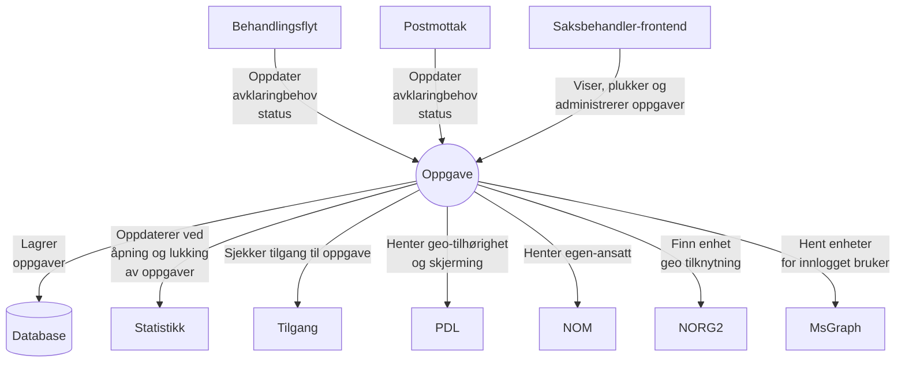

# aap-oppgave

Oppgave-håndtering for Arbeidsavklaringspenger (AAP).
Holder tilstand på oppgaver oppstått i behandlingsflyt og postmottak-backend.
Inneholder følgende funksjonalitet:
* Opprett/lukk oppgaver utifra avklaringsbehov (for både behandlingsflyt og postmottak)
* Plukk og reserver neste oppgave for innlogget saksbehandler gitt et filter
* Hent mine reserverte oppgaver for innlogget saksbehandler
* Hent tilgjengelige filter
* Vedlikehold av filter
* Hent tilgjengelige enheter for innlogget bruker

# Kontekstdiagram

### API-dokumentasjon

APIene er dokumentert med Swagger: http://localhost:8080/swagger-ui/index.html

### Lokalt utviklingsmiljø:

Applikasjonen aap-oppgave bruker test-containers for integrasjonstest med databasen.
En Docker-container er derfor nødvendig.
For macOS og Linux anbefaler vi Colima. Det kan være nødvendig med et par tilpasninger:

* `export TESTCONTAINERS_DOCKER_SOCKET_OVERRIDE=$HOME/.colima/docker.sock`
* `export DOCKER_HOST=unix://$TESTCONTAINERS_DOCKER_SOCKET_OVERRIDE`
* `export TESTCONTAINERS_RYUK_DISABLED=true`

