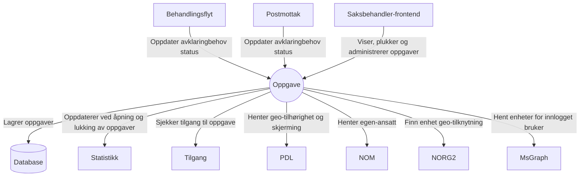

# aap-oppgave

Oppgave-håndtering for Arbeidsavklaringspenger (AAP).
Holder tilstand på oppgaver oppstått i behandlingsflyt og postmottak-backend.
Inneholder følgende funksjonalitet:
* Opprett/lukk oppgaver utifra avklaringsbehov (for både behandlingsflyt og postmottak)
* Plukk og reserver neste oppgave for innlogget saksbehandler gitt et filter
* Hent mine reserverte oppgaver for innlogget saksbehandler
* Hent tilgjengelige filter
* Vedlikehold av filter
* Hent tilgjengelige enheter for innlogget bruker

### Kontekstdiagram

### API-dokumentasjon

API-et er dokumentert med Swagger: \
https://aap-oppgave.intern.dev.nav.no/swagger-ui/index.html

### Lokalt utviklingsmiljø:

Applikasjonen aap-oppgave bruker test-containers for integrasjonstest med databasen.
En Docker-container er derfor nødvendig.
For macOS og Linux anbefaler vi Colima. Det kan være nødvendig med et par tilpasninger:

* `export TESTCONTAINERS_DOCKER_SOCKET_OVERRIDE=$HOME/.colima/docker.sock`
* `export DOCKER_HOST=unix://$TESTCONTAINERS_DOCKER_SOCKET_OVERRIDE`
* `export TESTCONTAINERS_RYUK_DISABLED=true`

### Kjøre lokalt mot dev-gcp

Prosjektet inneholder en run config som kan kjøres av IntelliJ. Burde være synlig under "Run configurations" med navnet
`dev-gcp.run.xml`.

For at det skal kjøre lokalt må du gjøre følgende:
1. Hent secret med [aap-cli/get-secret.sh](https://github.com/navikt/aap-cli): \
   `get-secret` \
2. Kjør opp lokal database med: \
   `docker-compose up -d`
3. Om du ønsker å hente data fra dev til lokal maskin kan du bruke [dump-gcp-db.sh](https://github.com/navikt/aap-cli?tab=readme-ov-file#dump-gcp-dbsh)
4. Kjør `dev-gcp` fra IntelliJ.

Etter dette vil appen kjøre mot reelle data. Her kan du velge om du vil koble deg på gjennom autentisert frontend eller
f.eks. gyldig token med cURL e.l.

OBS: Krever at du har `EnvFile`-plugin i IntelliJ. 